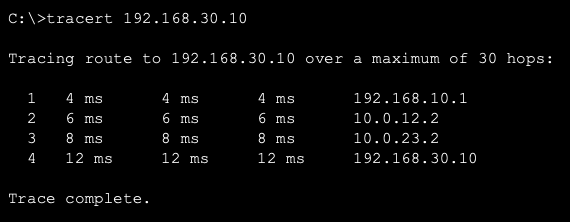

# Dynamic Routing with OSPF – Cisco Packet Tracer

## Overview

This project demonstrates **dynamic routing using OSPF (Open Shortest Path First)** across a three-router topology in Cisco Packet Tracer.

Unlike the earlier Static Routing lab — where every route had to be entered manually — OSPF was configured on all three routers so they could **automatically discover neighbors and exchange routing information**. Router2 sits in the middle with no local LAN, acting purely as a transit router between Router1's network and Router3's network.

This lab completes the routing series, contrasting manually configured static routes with a self-converging dynamic routing protocol.

---

## Objectives

- Understand the purpose and benefits of dynamic routing over static routing.
- Configure single-area OSPF on all three routers.
- Verify router interface addressing using `show ip interface brief`.
- Verify OSPF neighbor adjacency (FULL state) using `show ip ospf neighbor`.
- Verify OSPF-learned routes in the routing table using `show ip route` (`O` code).
- Understand OSPF cost metric shown as `[110/cost]`.
- Test end-to-end connectivity across all three routers.
- Use `tracert` to visualize the exact hop-by-hop path a packet takes.
- Compare TTL and hop count to confirm the number of routers traversed.

---

## Network Topology

PC1 sits behind Router1, Laptop2 sits behind Router3, and Router2 is a middle transit router with no directly attached hosts — connecting Router1 and Router3 in a linear chain.


| Device | IP Address | Connected To |
|---|---|---|
| PC1 | 192.168.10.10 | Switch 1 → Router1 |
| Laptop2 | 192.168.30.10 | Switch 2 → Router3 |
| Router1 (Gi0/1) | 192.168.10.1 | LAN 1 gateway |
| Router1 (Gi0/0) | 10.0.12.1 | WAN link to Router2 |
| Router2 (Gi0/2) | 10.0.12.2 | WAN link to Router1 |
| Router2 (Gi0/1) | 10.0.23.1 | WAN link to Router3 |
| Router3 (Gi0/2) | 10.0.23.2 | WAN link to Router2 |
| Router3 (Gi0/0) | 192.168.30.1 | LAN 2 gateway |

---

## Router Interface Verification

Identified by matching each interface's IP address to its position in the topology (Router1 = 10.0.12.1 side, Router2 = middle with both WAN IPs, Router3 = 192.168.30.1 side).

**Router1** — LAN-facing Gi0/1, WAN-facing Gi0/0:


| Interface | IP Address | Status |
|---|---|---|
| GigabitEthernet0/0 | 10.0.12.1 | up/up |
| GigabitEthernet0/1 | 192.168.10.1 | up/up |

**Router2** — no LAN, both interfaces face WAN links:


| Interface | IP Address | Status |
|---|---|---|
| GigabitEthernet0/1 | 10.0.23.1 | up/up |
| GigabitEthernet0/2 | 10.0.12.2 | up/up |

**Router3** — LAN-facing Gi0/0, WAN-facing Gi0/2:


| Interface | IP Address | Status |
|---|---|---|
| GigabitEthernet0/0 | 192.168.30.1 | up/up |
| GigabitEthernet0/2 | 10.0.23.2 | up/up |

---

## OSPF Neighbor Verification

Confirms each router formed a **FULL** adjacency with its directly connected OSPF neighbor(s).

**Router1** — one neighbor (Router2) via Gi0/0:


**Router2** — two neighbors (Router1 and Router3), confirming its role as the middle transit router:


**Router3** — one neighbor (Router2) via Gi0/2:


---

## OSPF Routing Table

Routes learned via OSPF are marked with the `O` code, along with their administrative distance and cost `[110/cost]`.

**Router1** — learns the remote WAN link and LAN 2 via Router2:


```text
O    10.0.23.0/30 [110/2] via 10.0.12.2
O    192.168.30.0/24 [110/3] via 10.0.12.2
```

**Router2** — learns both LANs directly, one hop each:


```text
O    192.168.10.0/24 [110/2] via 10.0.12.1
O    192.168.30.0/24 [110/2] via 10.0.23.2
```

**Router3** — learns the remote WAN link and LAN 1 via Router2:


```text
O    10.0.12.0/30 [110/2] via 10.0.23.1
O    192.168.10.0/24 [110/3] via 10.0.23.1
```

Note how the cost increases from `2` to `3` as the destination gets one hop farther away — this is OSPF's cost metric accumulating across the path.

---

## End-to-End Connectivity Test

PC1 (`192.168.10.10`) pinged Laptop2 (`192.168.30.10`) across all three routers. The first packet timed out (OSPF/ARP convergence delay), but the remaining 3 packets succeeded with **TTL = 125** — three less than the default 128, confirming the packet passed through **three router hops** (Router1 → Router2 → Router3).


---

## Traceroute Verification

`tracert` from PC1 to Laptop2 confirms the exact path taken, hop by hop, matching the topology exactly.



```text
1   192.168.10.1    (Router1 – LAN gateway)
2   10.0.12.2       (Router2)
3   10.0.23.2       (Router3)
4   192.168.30.10   (Laptop2 – destination)
```

---

## Key Learning Outcomes

- OSPF automatically discovers neighbors and builds the routing table — no manual route entries needed, unlike static routing.
- `show ip ospf neighbor` confirms adjacency state; `FULL` means the routers have fully synchronized their link-state databases.
- OSPF routes appear in the routing table with code `O` and administrative distance `110`, followed by the accumulated cost.
- A middle "transit" router (Router2) with no local LAN still participates fully in OSPF, forwarding traffic between the networks on either side of it.
- `tracert` is a reliable way to visually confirm the exact router-by-router path a packet takes, complementing the TTL-based hop count from a simple ping.
