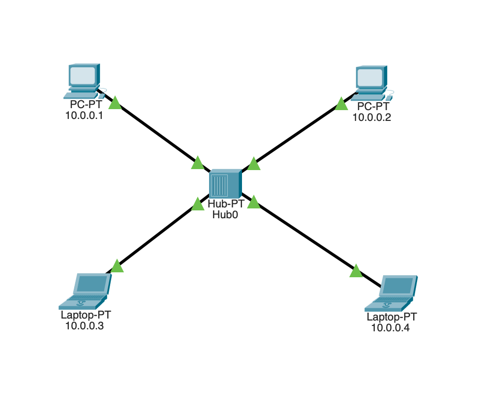
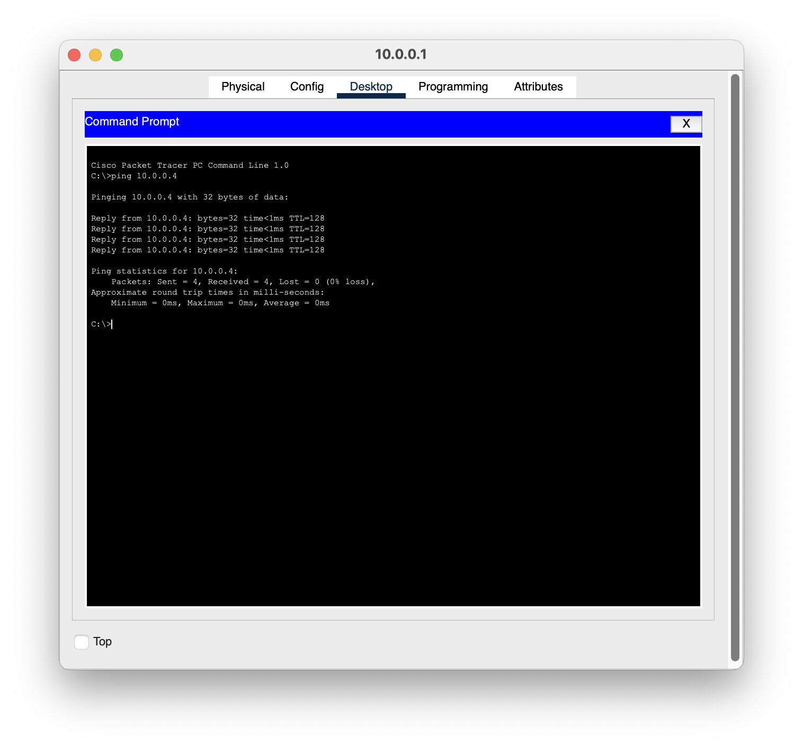

# Hub Working – Cisco Packet Tracer Lab

## Objective
To understand and demonstrate the working of a network hub using Cisco Packet Tracer.

## Tool Used
- Cisco Packet Tracer

## Concepts Practiced
- Network topology
- Hub-based communication
- End devices
- Ethernet connections
- Basic network connectivity
- Packet transmission

## Project File
The `.pkt` file contains the complete Cisco Packet Tracer topology and configuration.

## What I Learned
Through this lab, I learned how devices communicate through a hub and how network traffic is handled in a basic network environment.

## Learning Source
This lab was created as part of my self-learning journey in computer networking and cybersecurity.
## Network Topology

## Connectivity Verification

Connectivity was verified using ping between the configured devices.

## Packet Flow

The simulation mode was used to observe how the packet travels through the network.

