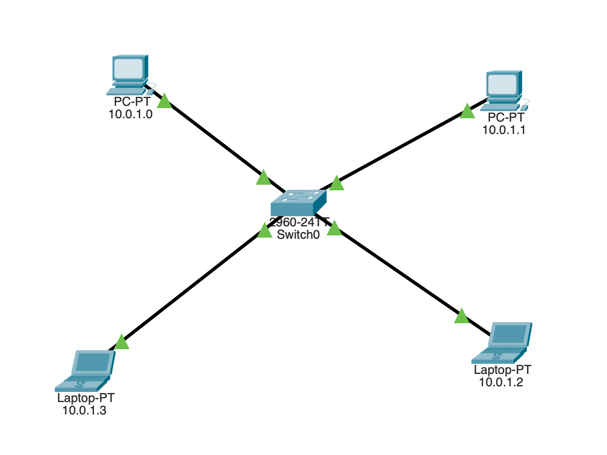
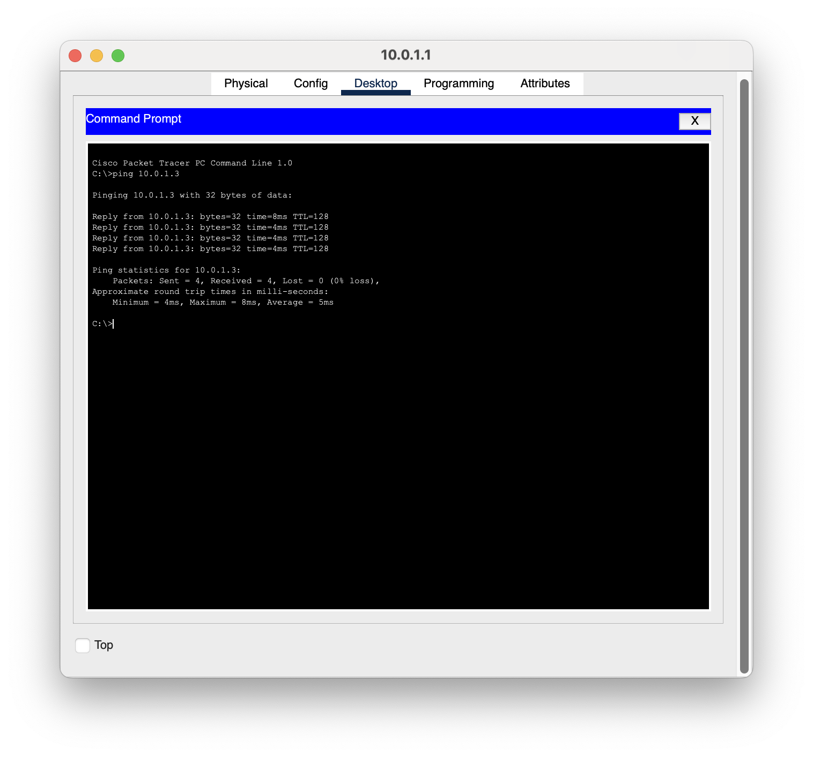

# Switch Working – Cisco Packet Tracer

## Overview

This project demonstrates the basic working of a Layer 2 Ethernet switch using Cisco Packet Tracer.

The lab focuses on how a switch learns MAC addresses, forwards Ethernet frames, handles ARP broadcasts, and enables communication between devices within the same local network.

---

## Objective

The main objectives of this lab are:

- Understand the basic operation of a Layer 2 switch.
- Observe how switches learn and maintain MAC address tables.
- Understand Ethernet frame forwarding.
- Observe ARP broadcast behavior.
- Verify end-to-end connectivity between hosts.
- Analyze packet processing using the OSI model in Cisco Packet Tracer.

---

## Network Topology

The network was created and tested in Cisco Packet Tracer.



---

## IP Addressing

| Device | IP Address |
|--------|------------|
| PC1 | 10.0.1.1 |
| PC2 | 10.0.1.3 |

The devices were placed within the same IP network to demonstrate local network communication through the switch.

---

## Connectivity Verification

Connectivity was verified using ICMP ping from `10.0.1.1` to `10.0.1.3`.

The test resulted in:

- Packets Sent: 4
- Packets Received: 4
- Packet Loss: 0%



This confirms successful communication between the hosts through the switch.

---

## MAC Address Learning

The switch's MAC address table was inspected using:

```text
show mac address-table
