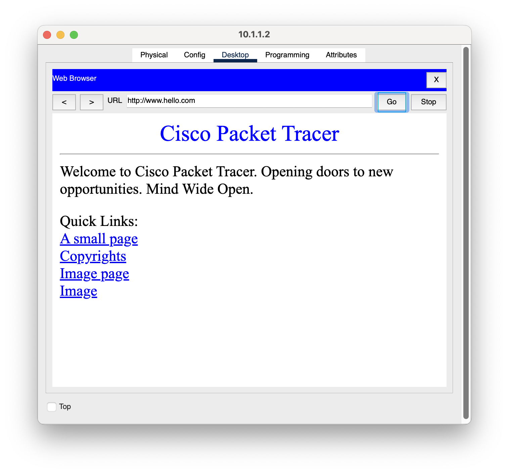

# TCP/IP and OSI Layers – Packet Analysis

## Overview

This project demonstrates the practical relationship between the **TCP/IP model** and the **OSI reference model** using Cisco Packet Tracer.

A simple client-server topology was built where a PC accesses a web server using HTTP. Cisco Packet Tracer's **Simulation Mode** was then used to capture and inspect the actual Protocol Data Unit (PDU) as it moved through each layer — from the application layer (HTTP) down to the physical layer (Ethernet), and back up again at the destination.

The goal of this lab is to visually connect theoretical OSI/TCP-IP concepts (encapsulation, headers, ports, addressing) with real packet behavior captured during simulation.

---

## Objectives

- Understand the seven layers of the OSI model and how they map to the four layers of the TCP/IP model.
- Observe encapsulation and de-encapsulation of data as it travels through each layer.
- Inspect Layer 2 (Ethernet), Layer 3 (IP), Layer 4 (TCP), and Layer 7 (HTTP) headers in a live simulation.
- Analyze Inbound and Outbound PDU details at a receiving device.
- Verify end-to-end connectivity between client and server using a real HTTP request.
- Relate captured header fields (source/destination IP, MAC, ports, sequence numbers) to their theoretical purpose.

---

## Network Topology

A basic client-server setup was used, with a PC/laptop initiating an HTTP request to a web server across the network.

---

## Web Browser Connectivity Test

Before capturing packets, connectivity was verified by accessing the web server directly through the PC's browser using the configured hostname.

---

## OSI Model – PDU Inspection

Using Packet Tracer's Simulation Mode, the PDU Information window was opened at the destination device (**Server1 – 20.0.0.1**). The **OSI Model** tab shows a side-by-side comparison of the **In Layers** and **Out Layers**, including:

- **Layer 7 (HTTP)** – Application-level request/response
- **Layer 4 (TCP)** – Source/Destination ports (1026 → 80)
- **Layer 3 (IP)** – Source/Destination IP addresses (10.1.1.2 → 20.0.0.1)
- **Layer 2 (Ethernet II)** – Source/Destination MAC addresses

This confirms how a single HTTP request is progressively wrapped (encapsulated) with headers at each layer before transmission, and unwrapped in reverse order at the receiver.

---

## Inbound PDU Details

The **Inbound PDU Details** tab breaks down the exact byte-level and bit-level structure of the frame as it arrived at the server — covering the Ethernet II frame, IP header, TCP segment, and the HTTP request itself (`Host: www.hello.com`).

This view is useful for understanding real header field sizes (e.g., TTL, checksum, sequence number, flags) as defined by RFC standards.

---

## Outbound PDU Details

<!-- Screenshot not yet added — enable once uploaded by removing this comment block:
The **Outbound PDU Details** tab shows the same breakdown for the reply traveling back from the server to the client, confirming symmetric header handling in the reverse direction.

-->

---

## Key Learning Outcomes

- Every layer adds its own header (encapsulation) as data moves down the stack on the sender side.
- The receiver strips headers layer by layer (de-encapsulation) in the exact reverse order.
- TCP/IP's 4 layers (Application, Transport, Internet, Network Access) collectively perform the same job as OSI's 7 layers.
- Real header values (ports, IPs, MAC addresses, sequence numbers) can be directly observed in Packet Tracer, bridging theory with practical packet analysis.
